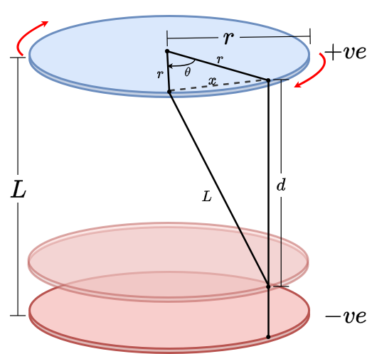

# Editorial for IUT Intra-University Programming Contest 2025

<details>
<summary>Problem A - Pacman vs. Vampire</summary>

Problem Setter: [Irfanur Rahman Rafio](https://codeforces.com/profile/Rafio)  
Estimated Difficulty: 1500  
Tag(s): Graph

<details>
<summary> Hint 1</summary>

The vampires know Pacman's moves.

</details>

<details>
<summary> Hint 2</summary>

Pacman should exit as soon as possible.

</details>

<details>
<summary> Hint 3</summary>

Find a way to count how many vampires can bite Pacman.

</details>

<details>
<summary> Hint 4</summary>

This problem has a crazy edge case.

</details>

<details>
<summary> Hint 5</summary>

What is the role of walls in this problem?

</details>

<details>
<summary>Solution</summary>

Since the vampires know Pacman's initial location and all moves (thus, the full path), there is no point for Pacman in trying to evade them. So Pacman's optimal strategy is to exit the game as soon as possible.

Each vampire is independent and can bite Pacman at most once. To bite Pacman, a vampire needs to occupy the same cell as Pacman at some point before Pacman exits the game. Now, consider the set of possible meeting points: the food cell (the cell containing the food), Pacman's position just before the food, the one before that, and so on, up to Pacman's starting cell.

If a vampire can meet Pacman at an earlier cell, then by following the same moves as Pacman, it can also meet Pacman at the food cell. The contrapositive is also true: if a vampire cannot reach the food cell in time, then it cannot meet Pacman at any earlier cell either. Therefore, the question "Can a vampire meet Pacman before it exits?" is equivalent to the simpler question "Can a vampire reach the food cell in time?"

This observation reduces the problem to comparing distances. Since both Pacman and the vampires move one cell per turn, a vampire can bite Pacman if and only if its distance to the food cell is less than or equal to Pacman's distance to the food cell.

To check this efficiently, you can run a BFS from the food cell. This gives the distance from the food to every other cell in the grid. Let $dP = \text{distance from Pacman's starting cell to the food}$ and $dV_i = \text{distance from the starting cell of the i-th Vampire to the food}$. The i-th vampire can successfully bite Pacman if and only if $dV_i \le dP$.

Finally, Pacman always gains $+500$ points for eating the food, and loses $10$ points for each vampire that manages to bite. Let the number of vampires that can bite Pacman be $B$. The optimal score is: $500 - 10B$.

The following is a compact version of this inference:  
$$
\text{Optimal Score} 
 = 500 - 10 \cdot \bigl|\{ \text{Vampires that can bite Pacman in an optimal play} \}\bigr| \\
 = 500 - 10 \cdot \bigl|\{ \text{Vampires that can meet Pacman before he exits} \}\bigr| \\
 = 500 - 10 \cdot \bigl|\{ \text{Vampires that can meet Pacman at the food cell} \}\bigr| \\
 = 500 - 10 \cdot \bigl|\{ \text{Vampires that can reach the food cell before Pacman or at the same turn} \}\bigr| \\
 = 500 - 10 \cdot \left|\left\{ V_i \;\middle|\; d(V_i,\text{food}) \le d(P,\text{food}) \right\}\right|
$$

However, this is an evil problem. Every statement written till now had a hidden assumption: Pacman can reach the food and exit the game. However, because of the walls, this may not be true. In that scenario, all the vampires that are in the same component as Pacman can bite Pacman. The optimal score will then be: $-10B$.

To find $B$, you have to run DFS/BFS from Pacman's initial cell and count how many vampires are in the same component.

Time Complexity = $\mathcal{O}(nm)$

<details>

<summary>Code</summary>

```
Code
```

</details>
</details>
</details>

<details>
<summary>Problem B - Roman Empire</summary>

Estimated Difficulty: 900  
Tag(s): Implementation

<details>
<summary>Hint</summary>
Hint

</details>

<details>
<summary>Solution</summary>
Solution

<details>
<summary>Code</summary>
Code

</details>
</details>
</details>

<details>
<summary>Problem C - Cursed Queries</summary>

Estimated Difficulty: 1900  
Tag(s): Data Structures, Range Query, Number Theory

<details>
<summary>Hint</summary>
Hint

</details>

<details>
<summary>Solution</summary>
Solution

<details>
<summary>Code</summary>
Code

</details>
</details>
</details>

<details>
<summary>Problem D - Disruptor's Incapacitated Capacitor</summary>

Estimated Difficulty: 1400  
Tag(s): Geometry

<details>
<<<<<<< HEAD
<summary>Hint 1</summary>

Focus on a single string; all strings behave the same due to symmetry.

</details>

<details>
<summary>Hint 2</summary>

After rotation by $\theta$, how far apart are the two attachment points around the rim? Think about the chord length of a circle of radius $r$.

</details>

<details>
<summary>Hint 3</summary>

Once you know this lateral distance, combine it with the unknown plate separation $d$ and the known string length $L$ using the Pythagorean theorem in 3D.

</details>

<details>
<summary>Hint 4</summary>
Be careful with angle units. Most programming languages expect trigonometric functions to use radians, not degrees.
=======
<summary>Hint</summary>
Hint
>>>>>>> 2445fad690c5b0c6306e5d895d3b82e5179d6144

</details>

<details>
<summary>Solution</summary>

The problem is essentially geometric. We are dealing with two circular plates of a capacitor, each with radius $r$, connected by several strings of equal length $L$. When the $+ve$ plate is rotated by an angle $\theta$, we need to compute the resulting distance $d$ between the plates. Each string connects two corresponding points on the rims of the two plates. Before rotation, the endpoints of a string align along the same radius. After rotating the $+ve$ plate by $\theta$, the two endpoints of a string on the two rims are no longer aligned but are separated by an angular difference of $\theta$.



Consider the two attachment points on the rims after rotation. Both points lie on a circle of radius $r$ centered at the axis of rotation, but separated by angle $\theta$. Hence, the distance $x$ between these two points (measured along the rim) is the chord length of a circle which can be obtained by the cosine rule of triangles as follows,


$x = \sqrt{r^2 + r^2 - 2r^2 \cos\theta} = \sqrt{2r^2 (1 - \cos\theta)}$

Now, each string forms the hypotenuse of a right triangle whose legs are:
* the distance between the two rim points, $x$, and
* the distance between the plates, $d$.

Thus, by Pythagoras:
$
L^2 = d^2 + x^2.
$

Substituting $x^2 = 2r^2(1 - \cos\theta)$ gives,

$
L^2 = d^2 + 2r^2(1 - \cos\theta).
$

Rearranging for $d$, we get,

$
\boxed{\,d = \sqrt{L^2 - 2r^2(1 - \cos\theta)}\,}
$

This is the required distance between the plates.
<details>
<summary>Code</summary>

```cpp
#include <bits/stdc++.h>
using namespace std;

#define SQR(a)                  ((a)*(a))
#define Godspeed                ios_base::sync_with_stdio(0);cin.tie(NULL)
#define urs(r...)               typename decay<decltype(r)>::type
#define REP(i,b)                for(urs(b) i=0;i<b;i++)
#define all(a)                  a.begin(),a.end()
#define Bye                     return 0
#define ll                      long long
#define LD                      long double
#define PI                      acos(-1.0)

int main()
{
    Godspeed;
    int Tests=1;
    cin>>Tests;
    while(Tests--)
    {
        ll r,L,theta;
        cin>>r>>L>>theta;
        LD theta_rad=theta*PI/180.0;
        LD res=sqrt(SQR(L)-(2.0*SQR(r)*(1.0-cos(theta_rad))));
        cout<<fixed<<setprecision(7)<<res<<endl;
    }
    Bye;
}
```

</details>
</details>
</details>

<details>
<summary>Problem E - Queen of Borderland</summary>

Estimated Difficulty: 1300  
Tag(s): Combinatorics, Math

<details>
<summary>Hint</summary>
Hint

</details>

<details>
<summary>Solution</summary>
Solution

<details>
<summary>Code</summary>
Code

</details>
</details>
</details>

<details>
<summary>Problem F - Fertilize to Maximize</summary>

Estimated Difficulty: 900  
Tag(s): Adhoc

<details>
<summary>Hint</summary>
Hint

</details>

<details>
<summary>Solution</summary>
Solution

<details>
<summary>Code</summary>
Code

</details>
</details>
</details>

<details>
<summary>Problem G - GCD vs. LCM</summary>

Estimated Difficulty: 1700  
Tag(s): Constructive, Number Theory

<details>
<summary>Hint</summary>
Hint

</details>

<details>
<summary>Solution</summary>
Solution

<details>
<summary>Code</summary>
Code

</details>
</details>
</details>

<details>
<summary>Problem H - Pythagoras' Playhouse</summary>

Estimated Difficulty: 2000  
Tag(s): Geometry, Math

<details>
<summary>Hint</summary>
Hint

</details>

<details>
<summary>Solution</summary>
Solution

<details>
<summary>Code</summary>
Code

</details>
</details>
</details>

<details>
<summary>Problem I - Crisis in Flatland</summary>

Estimated Difficulty: 1700  
Tag(s): DP

<details>
<summary>Hint</summary>
Hint

</details>

<details>
<summary>Solution</summary>
Solution

<details>
<summary>Code</summary>
Code

</details>
</details>
</details>

<details>
<summary>Problem J - Bit Lobon</summary>

Estimated Difficulty: 1300  
Tag(s): Bitmasks

<details>
<summary>Hint</summary>
Hint

</details>

<details>
<summary>Solution</summary>
Solution

<details>
<summary>Code</summary>
Code

</details>
</details>
</details>

<details>
<summary>Problem K - Kaboom!</summary>

Estimated Difficulty: 1200  
Tag(s): Binary Search, Interactive

<details>
<summary>Hint</summary>
Hint

</details>

<details>
<summary>Solution</summary>
Solution

<details>
<summary>Code</summary>
Code

</details>
</details>
</details>
