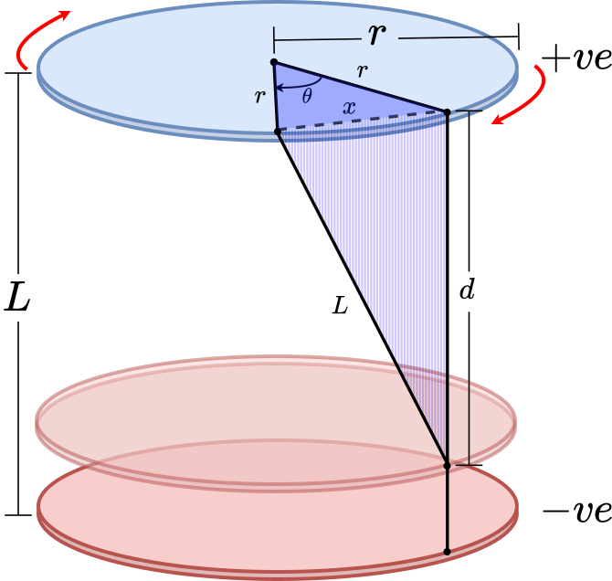

# Editorial for IUT Intra-University Programming Contest 2025

<details>
<summary>Problem A - Pacman vs. Vampire</summary>

Problem Setter: [Irfanur Rahman Rafio](https://codeforces.com/profile/Rafio)  
Estimated Difficulty: 1500  
Tag(s): Graph

<details>
<summary> Hint 1</summary>

The vampires know Pacman's moves.

</details>

<details>
<summary> Hint 2</summary>

Pacman should exit as soon as possible.

</details>

<details>
<summary> Hint 3</summary>

Find a way to count how many vampires can bite Pacman.

</details>

<details>
<summary> Hint 4</summary>

This problem has a crazy edge case.

</details>

<details>
<summary> Hint 5</summary>

What is the role of walls in this problem?

</details>

<details>
<summary>Solution</summary>

Since the vampires know Pacman's initial location and all moves (thus, the full path), there is no point for Pacman in trying to evade them. So Pacman's optimal strategy is to exit the game as soon as possible.

Each vampire is independent and can bite Pacman at most once. To bite Pacman, a vampire needs to occupy the same cell as Pacman at some point before Pacman exits the game. Now, consider the set of possible meeting points: the food cell (the cell containing the food), Pacman's position just before the food, the one before that, and so on, up to Pacman's starting cell.

If a vampire can meet Pacman at an earlier cell, then by following the same moves as Pacman, it can also meet Pacman at the food cell. The contrapositive is also true: if a vampire cannot reach the food cell in time, then it cannot meet Pacman at any earlier cell either. Therefore, the question "Can a vampire meet Pacman before it exits?" is equivalent to the simpler question "Can a vampire reach the food cell in time?"

This observation reduces the problem to comparing distances. Since both Pacman and the vampires move one cell per turn, a vampire can bite Pacman if and only if its distance to the food cell is less than or equal to Pacman's distance to the food cell.

To check this efficiently, you can run a BFS from the food cell. This gives the distance from the food to every other cell in the grid. Let $dP = \text{distance from Pacman's starting cell to the food}$ and $dV_i = \text{distance from the starting cell of the $i$-th vampire to the food}$. The $i$-th vampire can successfully bite Pacman if and only if $dV_i \le dP$.

Finally, Pacman always gains $+500$ points for eating the food, and loses $10$ points for each vampire that manages to bite. Let the number of vampires that can bite Pacman be $B$. The optimal score is: $500 - 10B$.

The following is a compact formulation of the inference:  
Optimal Score $= 500 - 10 \times |\\{ \text{Vampires that can bite Pacman in an optimal play} \\} |$  
 $= 500 - 10 \times |\\{ \text{Vampires that can meet Pacman before he exits} \\} |$  
 $= 500 - 10 \times |\\{ \text{Vampires that can meet Pacman at the food cell} \\} |$  
 $= 500 - 10 \times |\\{ \text{Vampires that can reach the food cell before Pacman or on the same turn} \\} |$  
 $= 500 - 10 \times |\\{ i : dV_i \le dP \\} |$

However, this is an **evil problem**. Every statement written till now had a hidden assumption: Pacman can reach the food and exit the game.  
However, because of the walls, this may not be true. It is possible that Pacman and the food are in separate components. In that scenario, all the vampires that are in the same component as Pacman can bite Pacman as the game won't end untill $10^7$ turns. The optimal score will then be: $-10B$.  
To find $B$, you can run DFS/BFS from Pacman's initial cell and count how many vampires are in the same component.

Time Complexity = $\mathcal{O}(nm)$

<details>

<summary>Code</summary>

```
Code
```

</details>
</details>
</details>

<details>
<summary>Problem B - Roman Empire</summary>

Estimated Difficulty: 900  
Tag(s): Implementation

<details>
<summary>Hint</summary>
Hint

</details>

<details>
<summary>Solution</summary>
Solution

<details>
<summary>Code</summary>
Code

</details>
</details>
</details>

<details>
<summary>Problem C - Cursed Queries</summary>

Estimated Difficulty: 1900  
Tag(s): Data Structures, Range Query, Number Theory

<details>
<summary>Hint</summary>
Hint

</details>

<details>
<summary>Solution</summary>
Solution

<details>
<summary>Code</summary>
Code

</details>
</details>
</details>

<details>
<summary>Problem D - Disruptor's Incapacitated Capacitor</summary>

Problem Setter: [Syed Rifat Raiyan](https://codeforces.com/profile/Starscream-11813)  
Estimated Difficulty: 1400  
Tag(s): Geometry

<details>

<summary>Hint 1</summary>

Focus on a single string; all strings behave the same due to symmetry.

</details>

<details>
<summary>Hint 2</summary>

After rotation by $\theta$, how far apart are the two attachment points around the $+ve$ plate? Think about the chord length of a circle of radius $r$.

</details>

<details>
<summary>Hint 3</summary>

Once you know this lateral distance, combine it with the unknown plate separation $d$ and the known string length $L$ using the Pythagorean theorem in 3D.

</details>

<details>
<summary>Hint 4</summary>
Be careful with angle units. Most programming languages expect trigonometric functions to use radians, not degrees.

</details>

<details>
<summary>Solution</summary>

The problem is essentially geometric. We are dealing with two circular plates of a capacitor, each with radius $r$, connected by several strings of equal length $L$. When the $+ve$ plate is rotated by an angle $\theta$, we need to compute the resulting distance $d$ between the plates. Each string connects two corresponding points on the edges of the two plates. Before rotation, the endpoints of a string align along the same radius. After rotating the $+ve$ plate by $\theta$, the two endpoints of a string on the two plates are no longer aligned but are separated by an angular difference of $\theta$.



Consider the two attachment points on the edges after rotation. Both points lie on a circle of radius $r$ centered at the axis of rotation, but separated by angle $\theta$. Hence, the distance $x$ between these two points is the chord length of a circle which can be obtained by the cosine rule of triangles as follows,

$x = \sqrt{r^2 + r^2 - 2r^2 \cos\theta} = \sqrt{2r^2 (1 - \cos\theta)}$

Now, each string forms the hypotenuse of a right triangle whose legs are:

- the distance between the two points on the $+ve$ plate's edge, $x$, and
- the distance between the plates, $d$.

Thus, by Pythagoras' theorem, $L^2 = d^2 + x^2$.

Substituting $x^2 = 2r^2(1 - \cos\theta)$ gives,

$L^2 = d^2 + 2r^2(1 - \cos\theta)$

Rearranging for $d$, we get,

$d = \sqrt{L^2 - 2r^2(1 - \cos\theta)}$

This is the required distance between the plates.

<details>
<summary>Code</summary>

```cpp
#include <bits/stdc++.h>
using namespace std;

#define SQR(a)                  ((a)*(a))
#define Godspeed                ios_base::sync_with_stdi\mathcal{O}(0);cin.tie(NULL)
#define urs(r...)               typename decay<decltype(r)>::type
#define REP(i,b)                for(urs(b) i=0;i<b;i++)
#define all(a)                  a.begin(),a.end()
#define Bye                     return 0
#define ll                      long long
#define LD                      long double
#define PI                      acos(-1.0)

int main()
{
    Godspeed;
    int Tests=1;
    cin>>Tests;
    while(Tests--)
    {
        ll r,L,theta;
        cin>>r>>L>>theta;
        LD theta_rad=theta*PI/180.0;
        LD res=sqrt(SQR(L)-(2.0*SQR(r)*(1.0-cos(theta_rad))));
        cout<<fixed<<setprecision(7)<<res<<endl;
    }
    Bye;
}
```

</details>
</details>
</details>

<details>
<summary>Problem E - Queen of Borderland</summary>

Problem Setter: [Akib Haider](https://codeforces.com/profile/_akibhaider_)  
Estimated Difficulty: 1300  
Tag(s): Combinatorics, Math

<details>
<summary>Hint</summary>

Solve for each color separately.

</details>

<details>
<summary>Solution</summary>

You need to find the number of combinations where, for each color, an even number of bottles remain. Since the condition for one color does not affect any other, you can solve the problem independently for each color and then multiply the results at the end.

Let the number of bottles of the $i$-th color be $n_i$. In a valid combination, the number of bottles that remain must be even. The number of ways to choose an even number of bottles is: $\displaystyle\binom{n_i}{0} + \binom{n_i}{2} + \binom{n_i}{4} + ... + \binom{n_i}{m}$, where $m$ is the largest even number such that $m \le n_i$ (that is, $m = n_i$ if $n_i$ is even, and $m = n_i - 1$ if $n_i$ is odd).

Time Complexity Analysis:  
For counting the combinations of the $i$-th color, you need $\mathcal{O}(n_i)$ operations.  
So, for all colors, the total is $\mathcal{O}(n_1 + n_2 + ... + n_{26}) = \mathcal{O}(n)$.  
Thus, the overall time complexity for a single round is $\mathcal{O}(n)$.  
The precalculation of factorials and inverse factorials (modular inverses of factorials) can be considered $\mathcal{O}(1)$.

<details>
<summary>Code</summary>

```cpp
#include <bits/stdc++.h>
using namespace std;

#define fastio ios_base::sync_with_stdio(0); cin.tie(0)
using LL = long long;

const LL MOD = 1e9 + 7;
const int N = 2e6 + 5;
LL fct[N], inv[N], invFct[N];

void initFct()
{
    fct[0] = 1;
    for(int i = 1; i < N; i++) fct[i] = (fct[i - 1] * i) % MOD;
}

void initModInv()
{
    int i, m, r;

    inv[1] = 1;
    for(i = 2; i < N; i++)
    {
        m = MOD / i, r = MOD % i;

        inv[i] = -m * inv[r];

        inv[i] %= MOD, inv[i] += MOD, inv[i] %= MOD;
    }
}

void initInvFct()
{
    invFct[0] = 1;
    for(int i = 1; i < N; i++) invFct[i] = (invFct[i - 1] * inv[i]) % MOD;
}

LL nCr(int n, int r)
{
    return fct[n] * invFct[r] % MOD * invFct[n - r] % MOD;
}


void pre()
{
    fastio;

    initFct();
    initModInv();
    initInvFct();
}

void solve(int tc)
{
    int i, n;
    string s;
    cin >> n >> s;

    vector<int> freq(26);
    for(char c: s) freq[c - 'a']++;

    LL ans = 1, t;
    for(auto x: freq) if(x > 0)
    {
        t = 0;
        for(i = 0; i <= x; i += 2)
        {
            t += nCr(x, i);
            t %= MOD;
        }

        ans *= t;
        ans %= MOD;
    }

    cout << ans;
}

int main()
{
    pre();

    int tc, tt = 1;
    cin >> tt;

    for(tc = 1; tc <= tt; tc++)
    {
        // cout << "Case " << tc << ": ";
        solve(tc);
        cout << '\n';
    }

    return 0;
}
```

</details>
</details>

<details>
<summary>Alternate Solution</summary>
Let's try to break the process of choosing an even number of bottles out of $n$ into two steps $(n > 0)$:

1. Choose any combination from the first $(n - 1)$ bottles.
2. If the number of chosen bottles is even, then remove the last bottle; otherwise, keep it.

Step 1 can be done in $2^{n - 1}$ ways.  
Step 2 has exactly $1$ valid choice given Step 1.  
Therefore, the total number of ways is $2^{n - 1}$.

From combinatorics, this agrees with the identity:  
$\displaystyle\binom{n}{0} + \binom{n}{2} + \binom{n}{4} + ... + \binom{n}{m} = 2^{n - 1}$ for any $n > 0$ where $m$ is the largest even number such that $m \le n$.

For finding the value of $2^x$, you can use binary exponentiation, precalculate the powers of $2$ untill $10^6$, or even run a loop (since the sum of $n$ over all test cases is within $2 \times 10^6$).

The time complexity is $\mathcal{O}(n)$ because you have to build the frequency array.

<details>
<summary>Code</summary>

```cpp
#include <bits/stdc++.h>
using namespace std;

#define fastio ios_base::sync_with_stdio(0); cin.tie(0)
using LL = long long;

const LL MOD = 1e9 + 7;

LL binExp(LL a, LL p)
{
    if(p == 0) return 1;
    if(p % 2 == 1) return a * binExp(a, p - 1) % MOD;
    return binExp(a * a % MOD, p / 2);
}


void pre()
{
    fastio;


}

void solve(int tc)
{
    int i, n;
    string s;
    cin >> n >> s;

    vector<int> freq(26);
    for(char c: s) freq[c - 'a']++;

    LL ans = 1, t;
    for(auto x: freq) if(x > 0)
    {
        ans *= binExp(2, x - 1);
        ans %= MOD;
    }

    cout << ans;
}

int main()
{
    pre();

    int tc, tt = 1;
    cin >> tt;

    for(tc = 1; tc <= tt; tc++)
    {
        // cout << "Case " << tc << ": ";
        solve(tc);
        cout << '\n';
    }

    return 0;
}
```

</details>
</details>

<details>
<summary>Alternate Solution</summary>

Let $k$ be the number of colors with at least one bottle.  
$2^{n_1 - 1} \times 2^{n_2 - 1} \times ... \times 2^{n_k - 1}$ simplifies to $2^{n - k}$.

The time complexity is still $\mathcal{O}(n)$ because you have to count the value of $k$.

<details>
<summary>Code</summary>
#include <bits/stdc++.h>

```cpp
#include <bits/stdc++.h>
using namespace std;

#define fastio ios_base::sync_with_stdio(0); cin.tie(0)
using LL = long long;

const LL MOD = 1e9 + 7;
const int N = 1e6 + 5;
LL pow2[N];


void pre()
{
    fastio;

    pow2[0] = 1;
    for(int i = 1; i < N; i++) pow2[i] = 2 * pow2[i - 1] % MOD;
}

void solve(int tc)
{
    int i, n;
    string s;
    cin >> n >> s;

    vector<int> freq(26);
    for(char c: s) freq[c - 'a']++;

    int k = 0;
    for(auto x: freq) if(x > 0) k++;

    cout << pow2[n - k];
}

int main()
{
    pre();

    int tc, tt = 1;
    cin >> tt;

    for(tc = 1; tc <= tt; tc++)
    {
        // cout << "Case " << tc << ": ";
        solve(tc);
        cout << '\n';
    }

    return 0;
}
```

</details>
</details>
</details>

<details>
<summary>Problem F - Fertilize to Maximize</summary>

Estimated Difficulty: 900  
Tag(s): Adhoc

<details>
<summary>Hint</summary>
Hint

</details>

<details>
<summary>Solution</summary>
Solution

<details>
<summary>Code</summary>
Code

</details>
</details>
</details>

<details>
<summary>Problem G - GCD vs. LCM</summary>

Estimated Difficulty: 1700  
Tag(s): Constructive, Number Theory

<details>
<summary>Hint</summary>
Hint

</details>

<details>
<summary>Solution</summary>
Solution

<details>
<summary>Code</summary>
Code

</details>
</details>
</details>

<details>
<summary>Problem H - Pythagoras' Playhouse</summary>

Estimated Difficulty: 2000  
Tag(s): Geometry, Math

<details>
<summary>Hint</summary>
Hint

</details>

<details>
<summary>Solution</summary>
Solution

<details>
<summary>Code</summary>
Code

</details>
</details>
</details>

<details>
<summary>Problem I - Crisis in Flatland</summary>

Estimated Difficulty: 1800  
Tag(s): DP

<details>
<summary>Hint</summary>
Hint

</details>

<details>
<summary>Solution</summary>
Solution

<details>
<summary>Code</summary>
Code

</details>
</details>
</details>

<details>
<summary>Problem J - Bit Lobon</summary>

Estimated Difficulty: 1300  
Tag(s): Bitmasks

<details>
<summary>Hint</summary>
Hint

</details>

<details>
<summary>Solution</summary>
Solution

<details>
<summary>Code</summary>
Code

</details>
</details>
</details>

<details>
<summary>Problem K - Kaboom!</summary>

Estimated Difficulty: 1200  
Tag(s): Binary Search, Interactive

<details>
<summary>Hint</summary>
Hint

</details>

<details>
<summary>Solution</summary>
Solution

<details>
<summary>Code</summary>
Code
</details>
</details>
</details>
