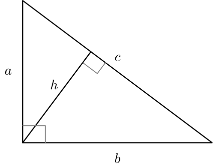

<details>
<summary>Problem H - Pythagoras' Playhouse</summary>

Problem Setter: [Irfanur Rahman Rafio](https://codeforces.com/profile/Rafio)  
Estimated Difficulty: 2000  
Tag(s): Geometry, Math

<details>
<summary>Hint 1</summary>

What is the longest side of a right triangle?

</details>

<details>
<summary>Hint 2</summary>

If $(a, b, c)$ is a Pythagorean triangle, $(ka, kb, kc)$ is also a Pythagorean triangle, for any positive integer $k$.

</details>

<details>
<summary>Hint 3</summary>

Analyze the parity of the three sides.

</details>

<details>
<summary>Solution</summary>

Let the side lengths of a right riangle be $(a, b, c)$ where $c$ is the length of the hypotenuse.

To fit this triangle inside a semicircle, you must first ensure that all three sides of the triangle can fit within the semicircle. The longest side of a right triangle is its hypotenuse, and the longest chord of a circle is its diameter. Therefore, the hypotenuse cannot be longer than the diameter of the semicircle.

Moreover, if you place the hypotenuse along the diameter, the triangle will always fit inside the semicircle. This follows from the fact that **"An angle inscribed in a semicircle is always a right angle"**.

Hence, the triangle will fit inside a semicircle of radius $r$ if and only if: $c \le d$, where $d = 2r$.

With this, the problem reduces to counting the number of triples $(a, b, c)$ of positive integers such that $a^2 + b^2 = c^2$ and $c \le d = 2r$.

---

Now, you have one equation and two unknowns. Since you do not have enough time to run a nested loop of $\mathcal{O}(d^2)$ time complexity, you need to _analyze the properties of Pythagorean triples_.

First of all, observe that: $a^2 + b^2 = c^2 => k^2a^2 + k^2b^2 = k^2c^2 => (ka)^2 + (kb)^2 = (kc)^2$.  
So, if $(a, b, c)$ is a Pythagorean triangle, $(ka, kb, kc)$ is also a Pythagorean triangle, for any positive integer $k$.

A Pythagorean triple $(a, b, c)$ where $\gcd(a, b, c) = 1$ is called a **primitive Pythagorean triple**.

If you can find such a primitive triple, then you can determine that there are $\displaystyle \lfloor \frac{d}{c} \rfloor$ different Pythagorean triangles that can fit inside the semicircle that are _similar_ to each other, where $d = 2r$ is the diameter. Therefore, the task is reduced to generating primitive Pythagorean triples efficiently.

---

Consider any primitive Pythagorean triple $(a, b, c)$.  
Suppose $\gcd(a, b) = g$. Then $a = a'g$ and $b = b'g$.  
Substituting, we get: $c^2 = g^2a'^2 + g^2b'^2 = g^2(a'^2 + b'^2)$.  
This means that $g$ must divide $c$.  
But if $g > 1$, then $\gcd(a, b, c) > 1$, contradicting primitiveness.

Hence, $\gcd(a, b) = 1$.  
Similarly, it can be shown that $\gcd(a, c) = 1$ and $\gcd(b, c) = 1$.  
This means that $(a, b, c)$ are pairwise coprime.

Since $(a, b, c)$ are pairwise coprime, two or more of them can't be even.  
However, all three of them can't be odd as the sum or the difference of two odd numbers have to be even.  
So, exactly one of $a$, $b$ and $c$ is even.

Now, $(2n + 1)^2 = 4n^2 + 4n + 1$, which is $1$ modulo $4$.  
So, if $a$ and $b$ are odd, $(a^2 + b^2)$ will be $2$ modulo $4$.  
But if $c$ is even, then $c^2$ must be divisible by $4$.  
So, if $(a, b, c)$ is a primitive Pythagorean triple, then $c$ cannot be even.

Without loss of generality, assume $a$ is odd and $b$ is even from here on.

---

Now, $c^2 = a^2 + b^2$  
 $=> c^2 - a^2 = b^2$  
 $=> (c + a)(c - a) = b^2$  
 $=> \displaystyle\frac{c + a}{b} = \frac{b}{c - a}$

Let $\displaystyle\frac{c + a}{b} = \frac{b}{c - a} = \frac{p}{q}$, where $p$ and $q$ are positive co-prime integers \[$p > q$ since $c + a > c > b$\].

So, $\displaystyle \frac{c}{b} + \frac{a}{b} = \frac{p}{q} \text{ and } \frac{c}{b} - \frac{a}{b} = \frac{q}{p}$

Solving the two equations, you'll get $\displaystyle \frac{c}{b} = \frac{p^2 + q^2}{2pq} \text{ and } \frac{a}{b} = \frac{p^2 - q^2}{2pq}$

Here, $p$ and $q$ are co-prime, so they can not both be even.  
If both $p$ and $q$ are odd, $p^2 + q^2$ is even.  
So, $c = \displaystyle \frac{b(p^2 + q^2)}{2pq}$ must be even.  
But $c$ must be odd.  
So, both $p$ and $q$ can't be odd.

Since $p$ and $q$ are co-prime and exactly one of them is odd, $p^2 - q^2 = (p + q)(p - q)$ and $2pq$ are co-prime.  
Since $a$ and $b$ are also co-prime, both the fractions $\displaystyle \frac{a}{b} \text{ and } \frac{p^2 - q^2}{2pq}$ are fully reduced.  
So, $a = p^2 - q^2$ and $b = 2pq$  
Similarly, $c = p^2 + q^2$

So, any primitive Pythagorean triple $(a, b, c)$ \[ $a$ is odd, $b$ is even, $c^2 = a^2 + b^2$ \] can be represented as $(a, b, c) = (p^2 - q^2, 2pq,  p^2 + q^2)$, where $p$ and $q$ are co-prime positive integers, $p > q$, and exactly one of them is even.

For any such $(p, q)$, it holds that $(p^2 - q^2)^2 + (2pq)^2 = (p^2 + q^2)^2$.  
This formula for generating primitive Pythagorean triples is known as **Euclid's formula**.

With this, the Pythagorean triples can be generated fast by looping over all possible valid $p$ and $q$.

---

Finally, to count all triples (a, b, c) that fit inside the semicircle, you need to:

1. Generate all primitive Pythagorean triples with $(a, b, c)$ \[ $a$ is odd, $b$ is even, $c^2 = a^2 + b^2$ \] where $c \le d$.
2. For each such triple $(a, b, c)$, count how many multiples $(ka, kb, kc)$ fit within $kc \le d$. This number is $\displaystyle \lfloor \frac{d}{c} \rfloor$.
3. Sum the number of multiples over all such triples.

**Time Complexity**:  
You need to generate primitive triples with $c \le d$.  
Since $c = p^2 + q^2$, it suffices to consider $p \le \sqrt{d}$.  
For each $p$, you iterate over possible $q < p \le \sqrt{d}$.  
So, the overall time complexity $= \mathcal{O}(\sqrt{d} \times \sqrt{d}) = \mathcal{O}(d) = \mathcal{O}(r)$

<details>
<summary>Code</summary>

```cpp
#include <bits/stdc++.h>
using namespace std;

#define fastio ios_base::sync_with_stdio(0); cin.tie(0)
using LL = long long;


void pre()
{
    fastio;


}

void solve(int tc)
{
    int r;
    cin >> r;

    int c, d = 2 * r, p, q, ans = 0;
    for(p = 2; p * p < d; p++)
    {
        for(q = 1; q < p; q++)
        {
            if(p % 2 == 1 && q % 2 == 1) continue;
            if(__gcd(p, q) > 1) continue;

            c = p * p + q * q;
            if(c > d) break;

            ans += d / c;
        }
    }

    cout << ans;
}

int main()
{
    pre();

    int tc, tt = 1;
    cin >> tt;

    for(tc = 1; tc <= tt; tc++)
    {
        // cout << "Case " << tc << ": ";
        solve(tc);
        cout << '\n';
    }

    return 0;
}
```

</details>
</details>
</details>

<details>
<summary>Bonus Problem</summary>

Pythagoras has become even more picky and will now only play with right triangluar toys that have an **integer** altitude to the hypotenuse. Here, the altitude to the hypotenuse means the length of the perpendicular drawn from the right angle of a right triangle to the hypotenuse.

For example, in the following figure, $h$ is the altitude to the hypotenuse:



Now count the number of toys that Pythagoras will buy.

</details>
